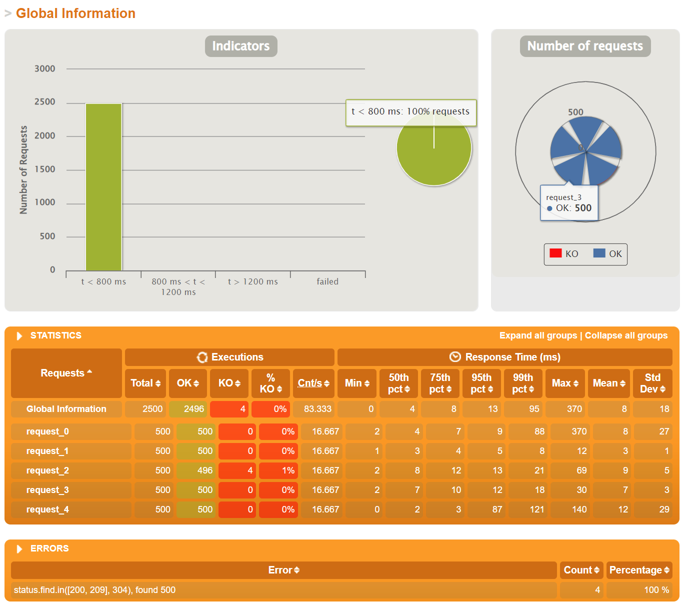
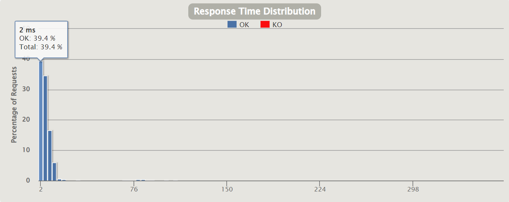

# aw10-final


Please develop a **fully functional** online purchase order system.

- It should have a superb collection of goods merchandises
- Customer can browse/search for merchandises, add selected one into his shopping cart and checkout to complete a transaction.
- User can get delivery status updates continuously.

The system should be of a **reactive architecture**, which means it should be 

-  Responsive: it should response to the user request timely.
-  Resilient: it should not be easily broken down.
-  Elastic: it should be flexible to scale out.
-  Message Driven: it should has loosely coupled components that communicates with each other asynchronously.


Please design tests/experiements to demostrate that your system fulfills such requirements as stated in [The Reactive Manifesto](https://www.reactivemanifesto.org)

**Submit your codes/documents/tests/experiements of your system.**


------

## 微服务架构


系统中共有5个微服务构成：

- discovery微服务是eureka服务器，其他微服务均对应的是客户端。
- gateway微服务，网关微服务，实际上就是为了对外提供一个统一的接口。
- products微服务，负责管理商品集合，提供了浏览搜索商品的能力。
- cart微服务，提供了添加商品到购物车以及结账接口。
- delivery微服务，负责处理交货状态，提供了信息查询接口，以及为用户推送订单状态。

系统中使用的是Amazon商品数据集。用户可以浏览、搜索、添加、购买商品，以及查看订单和物流信息。采用aw06中的模块将数据读进mysql


## 功能模块说明

### pos-discovery

功能：注册中心，使用eureka为每个微服务提供节点

### pos-gateway

功能：作为网关，将发送至网关的请求转发至每个微服务节点

```
GET http://localhost:8081/api/cart
GET http://localhost:8081/api/products
GET http://localhost:8081/api/orders
GET http://localhost:8081/api/delivery
...
```

### pos-products

功能：商品管理模块，为系统提供商品相关的服务接口

相关api：

```markdown
/api/products
	get: 查看所有商品信息
/api/products/{productId}
	get: 根据id查询某一特定商品信息	
```

### pos-counter

功能：计算模块，为系统提供计算购物车中商品总价值的服务，由pos-carts调用

### pos-carts

功能：购物车模块，商品可加入购物车中，为系统提供购物车相关的服务接口

相关api：

```markdown
/api/cart
	get: 看购物车中所有商品		
/api/cart/add/{productId}
	post: 购物车中添加商品
/api/cart/checkout
	post: 结账
```

### pos-order

功能：订单模块，购物车结账即产生订单，为系统提供订单相关的服务接口

```markdown
/api/order
    post: 产生一个订单
/api/order/{id}
    get: 根据id获取订单信息
```

### pos-delivery

功能：物流模块，订单产生后即生成相应的物流信息，为系统系统物流相关的服务接口

相关api：

```markdown
/api/delivery/byid/{id}
    get: 根据id获得物流信息
/api/delivery/byorder/{orderId}
    get: 根据订单id获得物流信息
```

### RabbitMQ

使用dockerConfig中的start和stop脚本即可建立和关闭rabbitMQ

## 性能测试

使用gatling进行性能测试，模拟500个用户的并发度，每个用户供执行5个请求，在30s内逐渐提升至500个并发用户数 

```markdown
1.查询商品列表
2.查询某个商品的具体信息
3.查看购物车
4.将商品加入购物车中
5.查看购物车
```

测试结果如下所示，



其中请求速度稍慢的是-->request_3向购物车中添加商品。在这样一个过程中，用户在第一次访问自己的购物车的时候，自动建立购物车需要一定的时间；添加商品是整个流程中的中间环节，此时系统的压力最大，会同时大量的请求来访问系统，导致速度响应时间变慢。


响应时间分布如下，可以看到大部分的请求都在合理的时间范围内解决了




## 响应式系统特点

### Responsive

- 通过前面的性能测试可以看到，大部分用户的响应时间都比较短，用户的体验相对较好。

### Resilient

整个系统采用微服务架构，将整个项目拆分成多个模块，每个模块可以部署在不同的服务器上。此时，可靠性体现在：

- 服务模块是多实例的，即使一个实例由于外部因素出现问题，由于多个实例的存在，系统整体仍然可以继续运行，保证了整个服务在大多数情况下的可用性。
- 基础设施可能挂掉。MySQL、RabbitMQ支持主从复制和集群配置；
- 此外，由于系统采用了Restful风格的接口，不主动在服务器端存储用户的状态，所以当一个服务的实例出现故障时，用户的状态不会丢失。

容错性主要是通过冗余来实现的。另外，服务限流和熔断机制也有一定帮助。

### Elastic

系统可以实现微服务弹性部署，灵活拓展。

- delivery 服务由 gateway 通过 IntegrationFlow 访问。
- 对于cart和delivery模块，他们实现松耦合，从而提高了各自的扩展性和可复用性。

### Message Driven

系统中不同服务之间采用消息驱动，使用rest接口和消息队列传递数据。

例如在订单模块创建一个订单的时候，就会使用消息队列来发送一条”创建物流“的消息，这条消息驱动物流系统创建一个物流信息。两个模块之间是松耦合的，整个过程是依赖于消息来进行驱动。